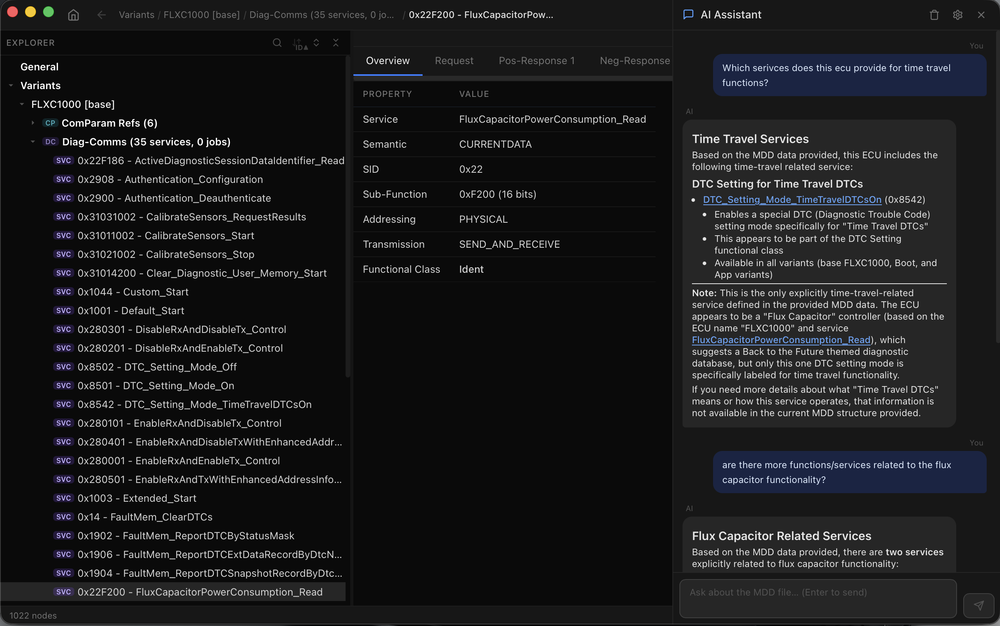

<!--
SPDX-License-Identifier: Apache-2.0
SPDX-FileCopyrightText: 2026 The Contributors to Eclipse OpenSOVD (see CONTRIBUTORS)

See the NOTICE file(s) distributed with this work for additional
information regarding copyright ownership.

This program and the accompanying materials are made available under the
terms of the Apache License Version 2.0 which is available at
https://www.apache.org/licenses/LICENSE-2.0
-->

# mdd-ui

A desktop application and CLI toolbox for MDD diagnostic databases, built with [Tauri](https://tauri.app/) and [Vue.js](https://vuejs.org/). It renders the full ECU diagnostic tree — variants, functional groups, shared data, protocols, services, parameters, and more — in an interactive graphical interface.



## Features

- **Hierarchical tree view** — browse ECU variants, functional groups, ECU shared data, protocols, layers, services, requests, responses, DOPs, SDGs, state charts, communication parameters, and functional classes.
- **Detail pane** — tabbed tables showing overview data, parameter lists, inherited references, and related items for the selected node.
- **Per-cell jump targets** — cells highlighted in blue are clickable links that navigate to the referenced element in the tree (e.g., jumping from a service's request to the request node itself).
- **Search** — incremental search with configurable scope (All, Variants, Services, Diag-Comms, Requests, Responses).
- **Sorting** — toggle alphabetical/ID sorting for DiagComm lists, and column-level sorting in detail tables.
- **Navigation history** — breadcrumb trail with back-navigation so you never lose your place.
- **Diff mode** — compare two MDD files with colour-coded additions, removals, modifications, and unchanged elements. The detail pane shows a table comparing old vs. new values for modified properties.
- **Export diff** — generate a plain-text diff report from the CLI.
- **MCP server** — expose browse, search, and diff tools over stdio for AI assistant integration.

## Installation

### Prerequisites

- Rust **2024 edition** (1.88+)
- [Bun](https://bun.sh/) (for the frontend build)
- [Tauri CLI](https://tauri.app/start/create-project/#manual-setup-tauri-cli) (`cargo install tauri-cli --locked`)

### Build from source

```sh
git clone https://github.com/eclipse-opensovd/mdd-ui
cd mdd-ui
cargo tauri build
```

The bundled application is placed at `target/release/bundle/`.

### macOS — "app is damaged" warning

Pre-built releases are not code-signed with an Apple Developer certificate. macOS Gatekeeper will therefore block the app on first launch with a "damaged" message.

Run the following command once after copying the app to `/Applications`:

```sh
xattr -cr /Applications/mdd-ui.app
```

Subsequent updates via the built-in auto-updater are downloaded programmatically and are **not** affected by this — they install silently without any manual step.

#### Build without code signing

Signing is required when `createUpdaterArtifacts` is enabled. To skip it without modifying [tauri.conf.json](cci:7://file:///Users/MOHALEX/dev/mdd-ui/tauri.conf.json:0:0-0:0), pass a config override via the shell:

```sh
cargo tauri build --config '{"bundle":{"createUpdaterArtifacts":false}}'
```

#### Linux: distributions that strip binaries (Arch, CachyOS, NixOS, …)

Some Linux distributions (e.g. Arch Linux, CachyOS, NixOS) strip debug symbols from binaries during the build process, which can break Tauri's bundler. Set `NO_STRIP=true` to prevent this:

```sh
NO_STRIP=true cargo tauri build
```

## Usage

### Desktop UI (default)

Launch the graphical application:

```sh
cargo tauri dev      # development, with hot-reload
cargo tauri build    # release build
```

### Export Diff (plain text)

Export a text-based diff report to a file or stdout:

```sh
mdd-ui export-diff <OLD_FILE> <NEW_FILE> [-o <OUTPUT_FILE>]
```

#### Example

```sh
mdd-ui export-diff old_ecu.mdd new_ecu.mdd -o diff_report.txt
mdd-ui export-diff old_ecu.mdd new_ecu.mdd  # prints to stdout
```

### MCP Server Mode

mdd-ui can run as an [MCP (Model Context Protocol)](https://modelcontextprotocol.io/) server over stdio, allowing AI assistants to browse, search, and diff MDD databases programmatically.

This requires building with the `mcp` feature:

```sh
cargo build --release --features mcp
```

Then start the server:

```sh
mdd-ui mcp
```

#### Available MCP Tools

| Tool | Description |
|---|---|
| `load_mdd` | Load an MDD file and return an ECU summary (name, variant count, etc.). Must be called before other read tools. |
| `browse_tree` | Navigate the tree hierarchy with optional depth limit and start index. |
| `get_node_details` | Get detailed information (overview tables, parameters, etc.) for a node by index. |
| `search_nodes` | Case-insensitive text search across all tree nodes. |
| `diff_mdd` | Compare two MDD files and return an annotated diff tree. |
| `export_diff` | Generate a full text diff report with property-level changes. |

#### OpenCode Configuration

To use the MCP server with [OpenCode](https://opencode.ai), add the following to your `opencode.json` (either in your project root or `~/.config/opencode/opencode.json`):

```json
{
  "mcp": {
    "mdd-ui": {
      "type": "local",
      "command": ["path/to/mdd-ui", "mcp"]
    }
  }
}
```

Replace `path/to/mdd-ui` with the actual path to your built binary (e.g., `target/release/mdd-ui`).

## Project Structure

This is a Cargo workspace with two crates:

```text
├── src/
│   ├── main.rs              # Entry point: Tauri app, export-diff CLI, mcp CLI
│   ├── commands.rs          # Tauri IPC commands (app state, search, diff, etc.)
│   └── mcp/                 # MCP server (optional, behind "mcp" feature)
│       └── mod.rs
├── frontend/                # Vue.js + Vite frontend
│   ├── src/
│   ├── package.json
│   └── vite.config.ts
├── src/mdd-core/            # Shared library crate
│   └── src/
│       ├── lib.rs
│       ├── database/        #   MDD file loading and data extraction
│       ├── diff/            #   Diff functionality (snapshot, compare, export)
│       └── tree/            #   Tree model, builder, types, and element modules
├── tauri.conf.json
└── capabilities/
```

## Dependencies

| Crate / Library | Purpose |
|---|---|
| [cda-database](https://github.com/eclipse-opensovd/classic-diagnostic-adapter) | MDD/FlatBuffers diagnostic database reader |
| [tauri](https://tauri.app) | Desktop application framework |
| [Vue.js](https://vuejs.org/) + [Vite](https://vitejs.dev/) | Frontend framework and build tool |
| [clap](https://docs.rs/clap) | Command-line argument parsing |
| [anyhow](https://docs.rs/anyhow) | Ergonomic error handling |
| [serde](https://serde.rs) | Serialization/deserialization |
| [rmcp](https://github.com/modelcontextprotocol/rust-sdk) | MCP server SDK (optional, `mcp` feature) |
| [tokio](https://tokio.rs) | Async runtime for MCP server (optional, `mcp` feature) |

## AI Assistant (GitHub Copilot)

The built-in AI assistant supports GitHub Copilot via OAuth Device Flow. Authentication uses the VS Code Copilot extension's GitHub App Client ID (`Iv1.b507a08c87ecfe98`), which is pre-approved on every GHE instance with Copilot enabled — no enterprise admin approval needed.

After the OAuth device flow obtains an access token, mdd-ui exchanges it for a short-lived Copilot API key via the `/copilot_internal/v2/token` endpoint. This key (and the API base URL returned by the exchange) are cached and automatically refreshed when they expire.

## License

Licensed under [Apache-2.0](LICENSE).

```text
SPDX-License-Identifier: Apache-2.0
```
